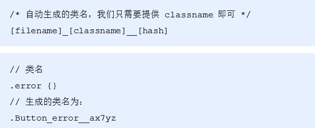
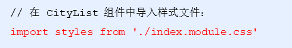
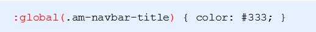

# 组件之间样式覆盖问题

## 目标

- 能够利用CSS Modules解决组件之间样式覆盖的问题

## 概念

- 问题：CityList组件的样式，会影响Map组件的样式
- 原因：在**配置路由**的时候，CityList组件与Map组件都会被导入到路由中，那么只要组件被导入，那么相关的样式也会被导入进来，如果两个组件的样式名称相同，那么就会影响另外一个组件的样式
- 小结：默认情况下，只要导入了组件，不管组件有没有显示在页面中，组件的样式就会生效
- 解决方式
  - 写不同的类名
  - CSS IN JS

## CSS IN JS

CSS IN JS 是使用JavaScript 编写 CSS 的统称，用来解决CSS样式冲突，覆盖等问题；

[CSS IN JS](https://github.com/MicheleBertoli/css-in-js) 的具体实现有50多种，比如：CSS Modules、styled-components等

推荐使用：CSS Modules（React脚手架已经集成进来了，可以直接使用）

## CSS Modules

### 概念

- CSS Modules 通过对CSS类名重命名，保证每一个类名的唯一性，从而避免样式冲突问题
- 实现方式：webpack的css-loader 插件
- 命名采用：BEM（Block块、Element元素、Modifier三部分组成）命名规范。比如： .list_item_active
- 在React脚手架中演化成：文件名、类名、hash（随机）三部分，只需要指定类名即可



### 使用

- 创建名为[name].module.css 的样式文件（React脚手架中的约定，与普通CSS区分开）


- 组件中导入样式文件**（注意语法）**



- 通过styles对象访问对象中的样式名来设置样式


### 使用CSS Modules修改 NavHeader 样式

- 在NavHeader目录中创建 index.module.css 的样式文件
- 在样式文件中修改当前组件的样式
- 对于组件库中已经有的全局样式，需要使用：global() 来指定，例如：我们在修改NavBar里面文字颜色的时候，用到了一个类名叫： am-navbar-title  这个类名不是我们设置的，而是组件库中定义的，所以对于这一类，我们需要这样去设置:



**或者：**


示例demo

```css
.navbar {
    color: #333;
    background-color: #f6f5f6;
}

.navbar :global(.am-navbar-title) {
    color: #333;
}
```

## 在Map组件中修改头部样式

```css
.map {
    height: 100%;
    padding-top: 45px;
}

.map :global(.am-navbar) {
    margin-top: -45px;
}

.container {
    height: 100%;
}
```

页面结构

```react
<div className={styles.map}>
    <NavHeader>
        地图找房
    </NavHeader>
    <div id='container' className={styles.container}></div>
</div>
```

